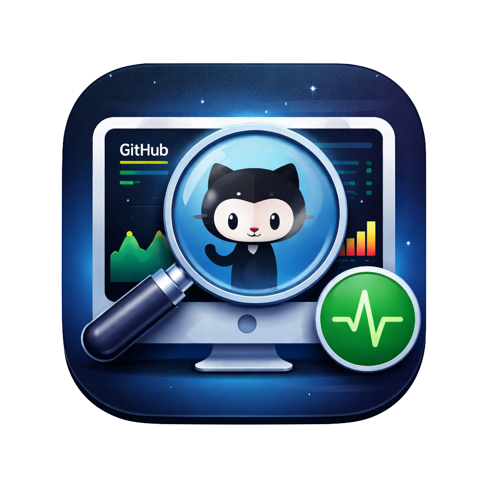
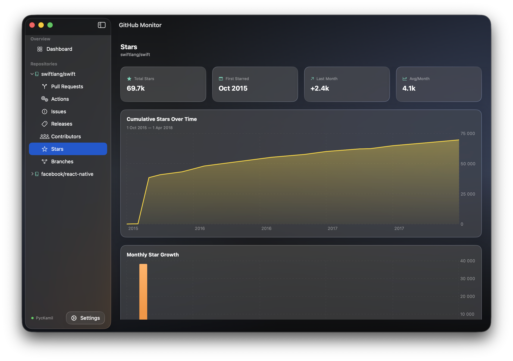
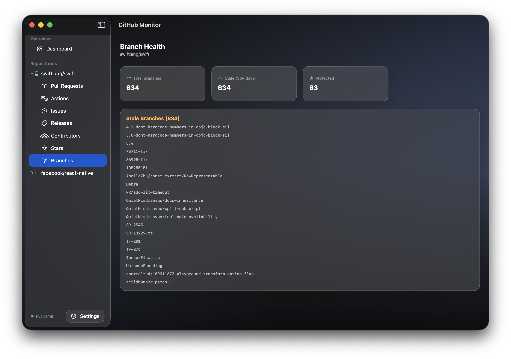

# GitHub Monitor

<p align="center">
  
</p>

<p align="center">
  <em>Can't keep up with AI agents pushing code 24/7? Neither can we.</em>
</p>

---

## Overview

In the era of AI-powered coding assistants and autonomous agents, your GitHub repositories are changing faster than ever. **GitHub Monitor** helps you stay on top of the constant stream of commits, pull requests, and updates happening across your projects.

## Screenshots

<p align="center">
  
  <br>
  <em>Repository Stars Analytics</em>
</p>

<p align="center">
  
  <br>
  <em>Branch Health Monitoring</em>
</p>

## Features

- 🔍 **Real-time Monitoring** - Track repository activity as it happens
- 📊 **Activity Dashboard** - Visualize commit patterns and contribution trends
- 🤖 **AI-Aware** - Built for the age of agent-driven development
- 💻 **Native macOS App** - Built with SwiftUI for macOS 14+

## Getting Started

This is a Swift-based macOS application that runs natively on your Mac.

### Requirements

- macOS 14.0 or later
- Swift 6.2 or later
- **GitHub CLI (`gh`)** - [Install from here](https://cli.github.com/)

### Setup

1. **Install GitHub CLI** if you haven't already:
   ```bash
   brew install gh
   ```

2. **Authenticate with GitHub**:
   ```bash
   gh auth login
   ```

### Building

```bash
swift build
swift run
```

## Why GitHub Monitor?

When AI coding agents can generate hundreds of commits while you sleep, traditional GitHub notifications just don't cut it. This tool gives you the visibility you need to stay in control of your rapidly evolving codebase.

## License

This project is licensed under the MIT License - see the [LICENSE](LICENSE) file for details.

---

*Keep calm and monitor on* 🚀
